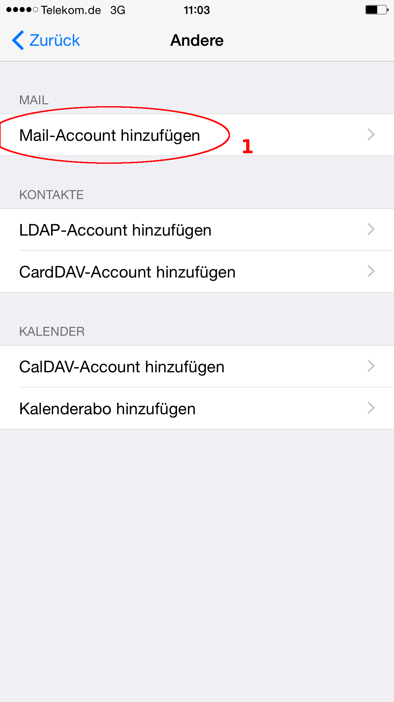

# Allgemeines

Diese Anleitung wurde für iOS 7 bzw. 8 geschrieben, frühere Versionen unterscheiden sich meist aber nur in der Anordnung oder Abbildung der Elemente.

# Einrichten

## Mail

Rufen Sie die Einstellungen (1) auf.

Wählen Sie **Mail, Kontakte, Kalender** (1).

Wählen Sie **Account hinzufügen** (1).

Bitte wählen Sie den Account-Typ **Andere** (1).

Wählen Sie **Mail-Account hinzufügen** (1).

Befüllen Sie bitte die einzelen Eingabefelder mit den entsprechenden Angaben (1) und klicken Sie danach auf **Weiter** (2).

<dl>
	<dt>Name</dt>
	<dd>Der angezeigte Absendername, meist <i>Vorname Nachname</i></dd>
	<dt>E-Mail</dt>
	<dd>Ihre E-Mail Adresse.</dd>
	<dt>Kennwort</dt>
	<dd>Ihr E-Mail Passwort</dd>
	<dt>Beschreibung</dt>
	<dd>Eine beliebige Beschreibung für diesen Mailaccount.</dd>
</dl>

Wählen Sie als Kontotyp **IMAP** (1) aus, tragen Sie die entsprechenden Einstellungen (2) ein und fahren Sie mit **Weiter** (3) fort.

Server für eintreffende E-Mails:

<dl>
	<dt>Hostname</dt>
	<dd>{IMAP_HOST}</dd>
	<dt>Benutzername</dt>
	<dd>Meist <i>vorname.nachname</i></dd>
	<dt>Kennwort</dt>
	<dd>Ihr E-Mail Passwort</dd>
</dl>

Server für ausgehende E-Mails:

<dl>
	<dt>Hostname</dt>
	<dd>{SMTP_HOST}</dd>
	<dt>Benutzername</dt>
	<dd>Meist <i>vorname.nachname</i></dd>
	<dt>Kennwort</dt>
	<dd>Ihr E-Mail Passwort</dd>
</dl>

Wählen Sie die zu synchronisierenden Daten aus (1) und beenden Sie die Konfiguration mit **Sichern** (2).

## Kalender

Rufen Sie die Einstellungen (1) auf.

Wählen Sie **Mail, Kontakte, Kalender** (1).

Wählen Sie **Account hinzufügen** (1).

Bitte wählen Sie den Account-Typ **Andere** (1).

Wählen Sie **CalDAV-Account hinzufügen** (1).

Tragen Sie die entsprechenden Einstellungen (1) ein und fahren Sie fort mit **Weiter** (2).

<dl>
	<dt>Server</dt>
	<dd>{SOGO_URL}</dd>
	<dt>Benutzername</dt>
	<dd>Meist <i>vorname.nachname</i></dd>
	<dt>Kennwort</dt>
	<dd>Ihr E-Mail Passwort</dd>
	<dt>Beschreibung</dt>
	<dd>Eine beliebige Beschreibung für dieses Konto</dd>
</dl>

Nachdem Sie ausgewählt haben welche Objekte synchronisiert werden sollen (1), beenden Sie die Konfiguration mit **Sichern** (2).

Je nach Größe ihrer Kalender kann die erste Synchronisierung einige Sekunden bis Minuten dauern.

## Adressbuch

Rufen Sie die Einstellungen (1) auf.

Wählen Sie **Mail, Kontakte, Kalender** (1).

Wählen Sie **Account hinzufügen** (1).

Bitte wählen Sie den Account-Typ **Andere** (1).

Wählen Sie **CardDAV-Account hinzufügen** (1).

Tragen Sie die entsprechenden Einstellungen (1) ein und beenden Sie die Konfiguration mit einem Klick auf **Weiter** (2).

<dl>
	<dt>Server</dt>
	<dd>{SOGO_URL}</dd>
	<dt>Benutzername</dt>
	<dd>Meist <i>vorname.nachname</i></dd>
	<dt>Kennwort</dt>
	<dd>Ihr E-Mail Passwort</dd>
	<dt>Beschreibung</dt>
	<dd>Eine beliebige Beschreibung für dieses Konto</dd>
</dl>
