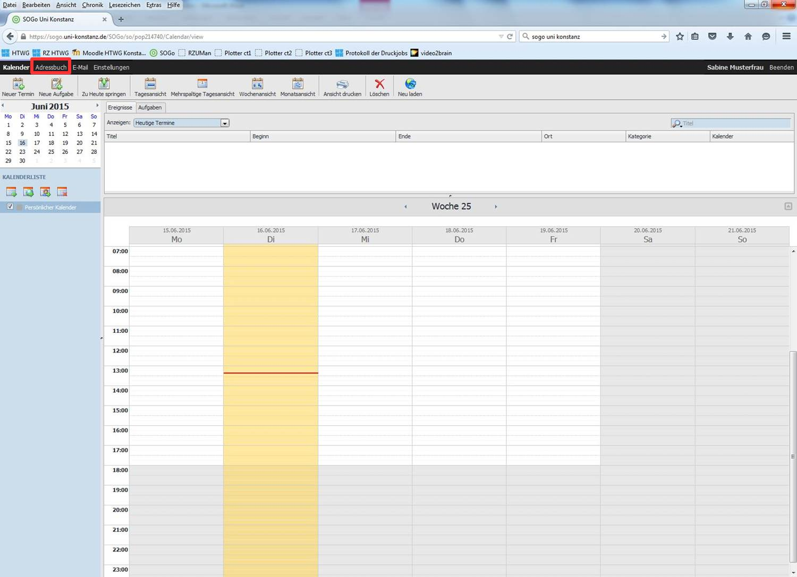
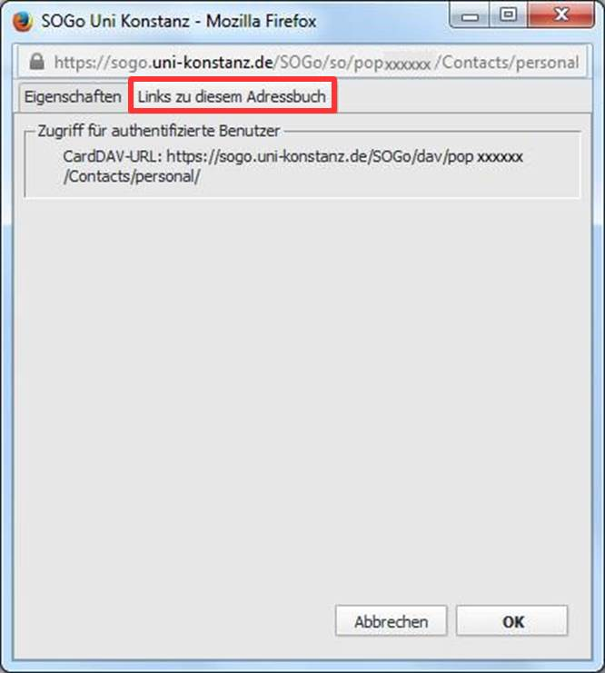
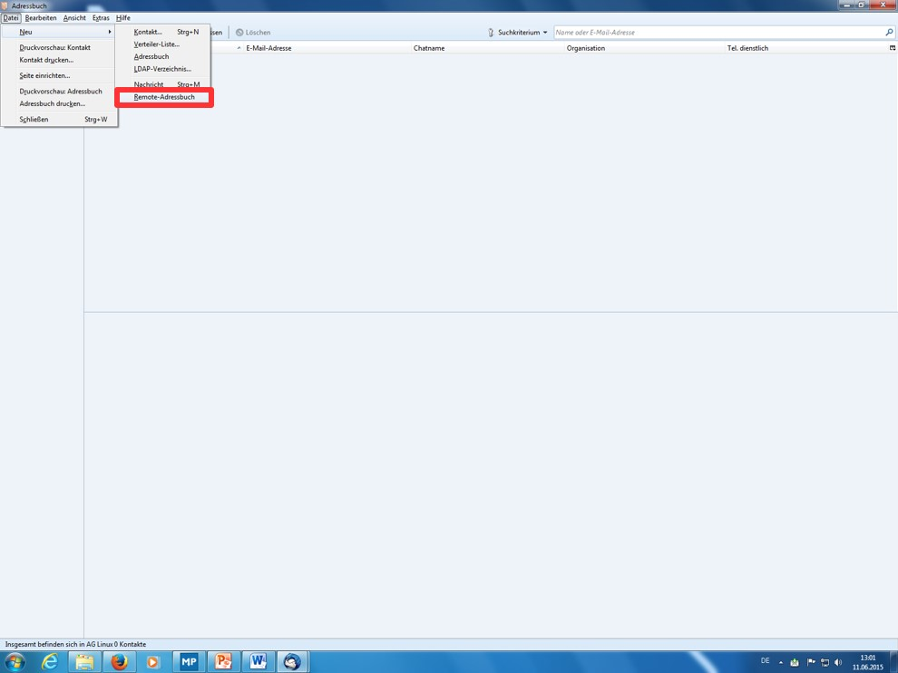

# Adressbuch

Um mit Thunderbird auch SOGo-Adressbücher nutzen zu können, benötigen Sie die Erweiterung SOGo Connector.

## Installation SOGo Connector

Öffnen Sie die URL [http://www.sogo.nu/downloads/frontends.html](http://www.sogo.nu/downloads/frontends.html) in Ihrem Browser. 

Beachten Sie folgende Schritte zur Installation:

- "SOGo Connector Thunderbird extension..." mit **Rechtsklick** markieren 
- "Ziel speichern unter ..." auswählen
- Speichern Sie die Datei an einem geeigneten Ort

Wählen Sie im Thunderbird Menü "Extras - Add-Ons" aus, um den **Add-On-Manager** zu öffnen.

Klicken Sie in der Kategorie Erweiterungen die Option "Add-On aus Datei installieren" an.

Wählen Sie jetzt die zuvor gespeicherte Datei für den SOGo Connector aus.

Nach dem Auswahldialog erscheint das Fenster "Software-Installation", bestätigen Sie dieses mit "Jetzt installieren".

Zur Vervollständigung der Installation muss Thunderbird erneut gestartet werden. Nach dem Neustart schließen Sie den Add-On Manager. 

## Adressbuch einrichten

Thunderbird verwaltet für jeden Nutzer ein "Persönliches Adressbuch" sowie  ein "Globales Adressbuch" der Hochschule. Dieses beinhaltet die Mailadressen der MitarbeiterInnen, ProfessorInnen und StudentInnen.
Globale Adressbücher sind durch ein Globus-Icon gekennzeichnet und bieten die Besonderheit, dass diese ausschließlich durchsucht werden können. Eine Auflistung aller Adressen ist nicht möglich, beim Durchsuchen muss mindestens ein Zeichen eingegeben werden, es werden dann maximal 15 Ergebnisse angezeigt.

### Persönliches Adressbuch einrichten

Klicken Sie auf "Extras - Adressbuch" um das Adressbuch zu öffnen.

Öffnen Sie nun die SOGo-Weboberfläche und wechseln sie in die Registerkarte "Adressbuch".

Wählen Sie ihr persönliches Adressbuch, welches Sie einfügen möchten, mit der rechten Maustaste aus, und klicken Sie nun "Eigenschaften".

Jetzt wechseln Sie zur Registerkarte "Links zu diesem Adressbuch". Markieren Sie die "CardDAV-URL" bei "Zugriff für authentifizierten Benutzer" und kopieren Sie diese, z.B. mit der Tastenkombination Strg + C.

Zurück im Thunderbird Adressbuch, klicken Sie auf "Datei - Neu - Remote-Adressbuch".

Im folgenden Fenster, geben Sie einen Verbindungsnamen an und fügen die zuvor kopierte "CardDAV-URL" bei URL: ein, z.B mit der Tastenkombination "Strg + V". Bestätigen Sie anschließend Ihre Eingaben mit "OK"

Beim nächsten Neustart von Thunderbird, oder einem manuellen Anstoßen der Synchronisation durch Rechtsklick auf das entsprechende Adressbuch ("Synchronisieren"), steht Ihnen das Adressbuch in Thunderbird zur Verfügung.

### Globales Adressbuch einrichten

Klicken Sie auf "Extras - Adressbuch" um das Adressbuch zu öffnen.

Klicken Sie auf "Datei - Neu - Remote-Adressbuch".

Geben Sie den Verbindungsnamen und die angegebene URL ein, die POP-ID ist durch Ihre eigene POP-ID zu ersetzen. Wählen Sie "Nur lesbar" und bestätigen Sie mit "OK".

Um die Adress-Autovervollständigung zu aktivieren wählen Sie "Extras - Einstellungen".

Klicken Sie hier "Verfassen"(1) und anschließend "Adressieren"(2). Danach wählen Sie Uni Konstanz als LDAP- Verzeichnisserver(3) aus und bestätigen Ihre Eingaben mit "OK".

## Adressbuch entfernen

Klicken Sie mit der rechten Maustaste auf das entsprechende Adressbuch und wählen Sie "Löschen".

