#Einrichten SOGo-Kalender#

Um mit Ihrem Thunderbird auch Kalender nutzen zu können benötigen Sie das Lightning-Plugin. Ab der Version 38.0.1 von Thunderbird ist das Lightning-Plugin automatisch integriert.

Über das Menü "Termine und Aufgaben -> Kalender" (1) wechseln Sie in die Kalenderansicht (2). Falls bei Ihnen die Menüleiste nicht angezeigt wird, klicken Sie mit der rechten Maustaste auf die Titelleiste und wählen "Menüleiste".

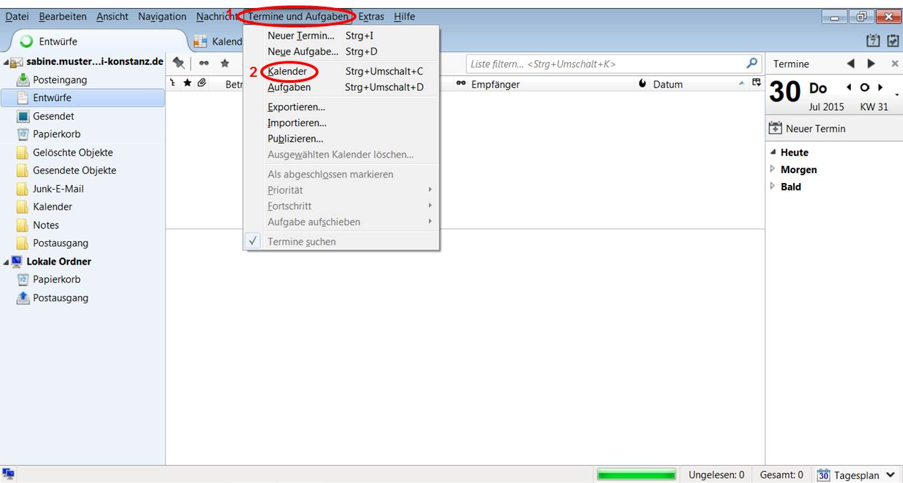

Nun befinden Sie sich in der Kalenderansicht.

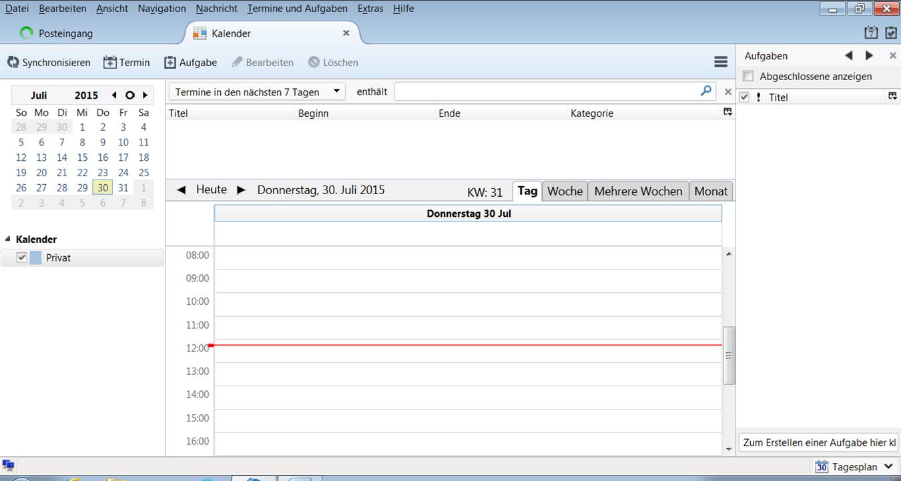

Öffnen Sie nun die SOGo-Weboberfläche, wählen Sie dort die Lasche "Kalenderliste" (1), klicken mit der rechten Maustaste über den Kalendernamen (2), den Sie in Lightning einfügen möchten. Wählen Sie nun "Einstellungen" (3) aus.

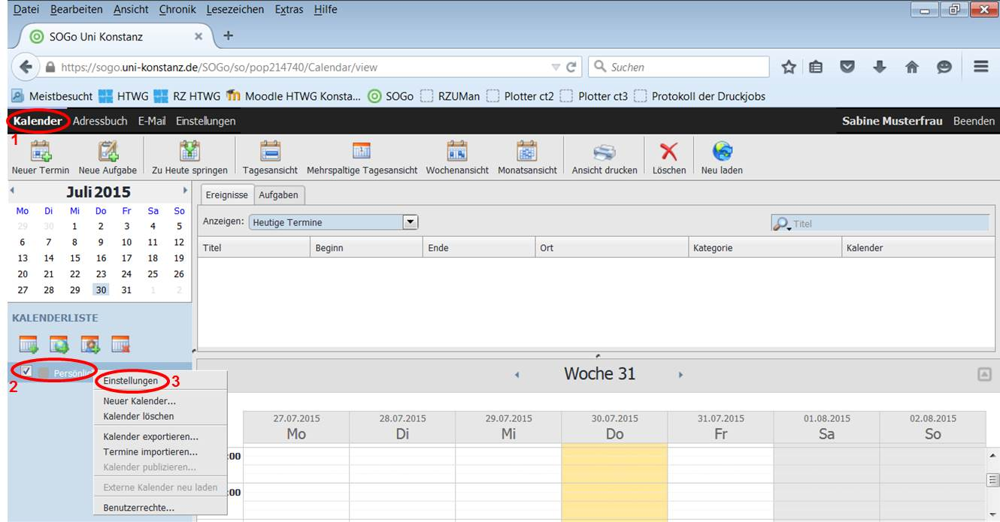

Jetzt wechseln Sie zur Registerkarte “Links zu diesem Kalender”. Markieren Sie die “CardDAV URL” bei “Zugriff für authentifizierten Benutzer” und kopieren Sie diese, z.B. mit der Tastenkombination Strg + C.

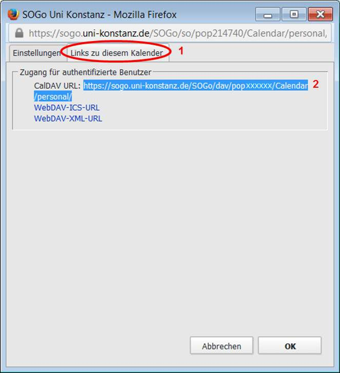

Zurück im Thunderbird Kalender, wählen Sie im freien Feld in der linken Spalte die rechte Maustaste und dort "Neuer Kalender..." (1): 

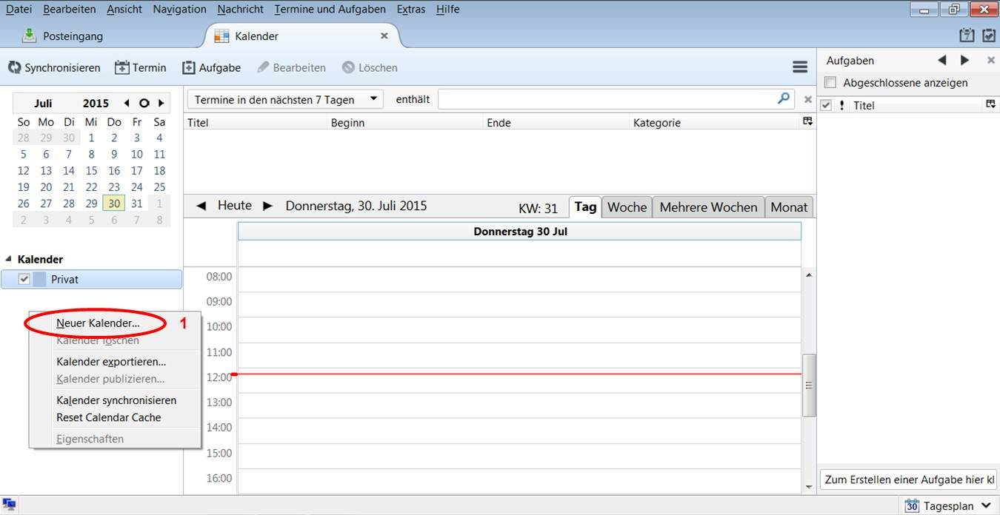

Wählen Sie "Im Netzwerk" (1) und bestätigen Sie mit "Weiter" (2).

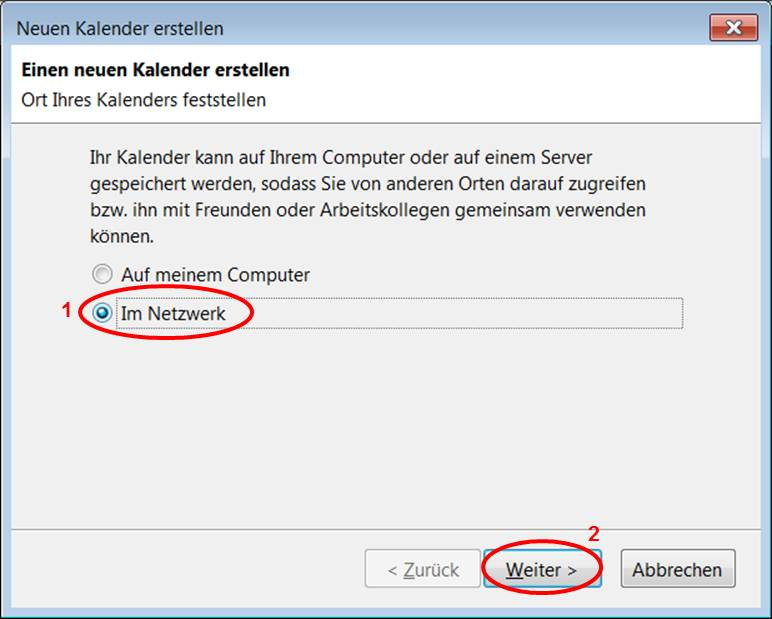

Wählen Sie jetzt "CalDAV" (1) aus. Fügen Sie die zuvor kopierte “CalDAV URL” bei "Adresse" (2) ein, z.B mit der Tastenkombination “Strg + V”. Bestätigen Sie anschließend Ihre Eingaben mit “Weiter” (3).

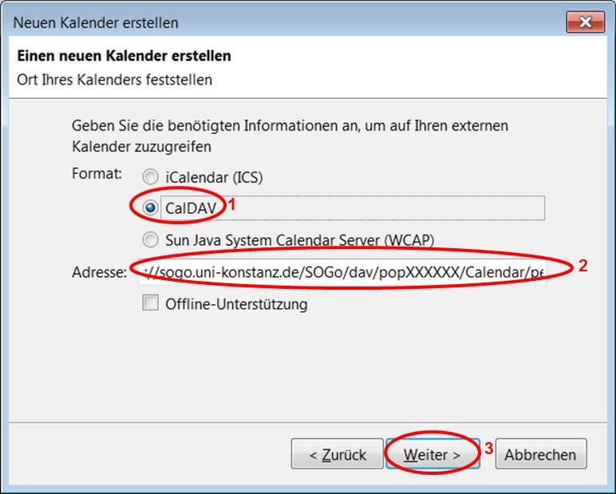

Sie können nun für den Kalender einen Namen angeben (1) und eine Farbe auswählen (2). Bestätigen Sie Ihre Eingaben mit "Weiter" (3).

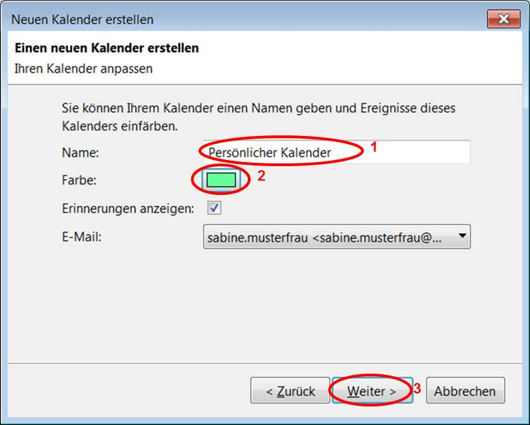

Nun ist eine Authentifizierung erforderlich. Geben Sie hier Ihren Benutzernamen vorname.nachname oder Ihre Mailadresse sowie Ihr Mailpasswort ein. Sie können den Haken bei Passowort-Manager setzen, um das Passwort zu speichern, bestätigen Sie die Eingaben mit "OK".

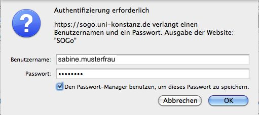

Ihr Kalender wurde nun erstellt, bestätigen Sie mit "Fertigstellen".

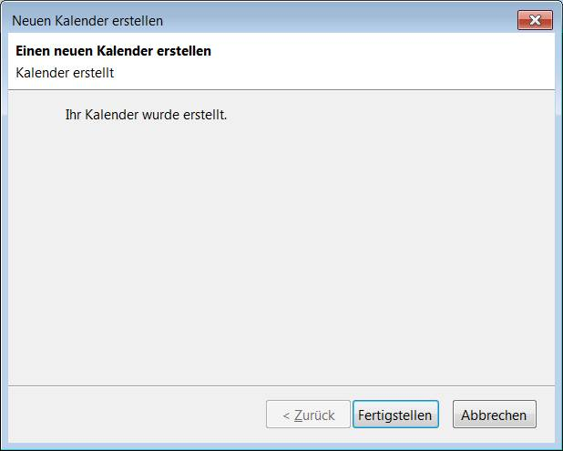

Jetzt sehen sie die Kalenderübersicht. Verfahren Sie so bitte mit jedem Kalender aus SOGo, den Sie in Thunderbird Lightning sehen/benutzen möchten (also in SOGo CalDAV-Link des Kalenders kopieren und mit "Neuer Kalender" als CalDAV-Kalender einfügen. 

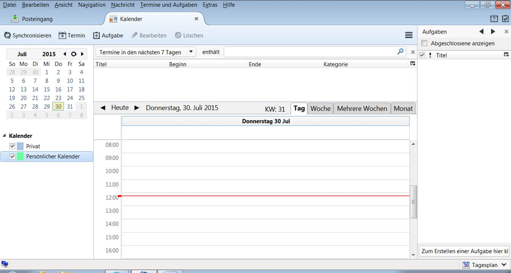

Die Besprechungsplanung mit den Frei-/Belegtzeiten funktioniert wie in der SOGo-Weboberfläche.

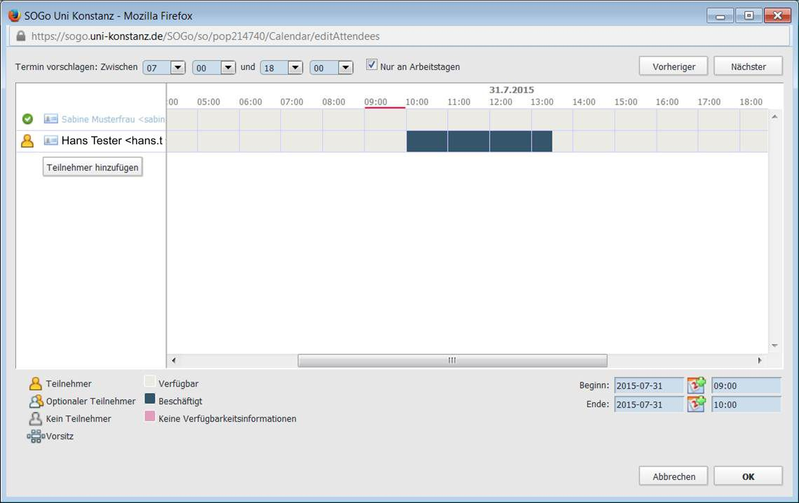
