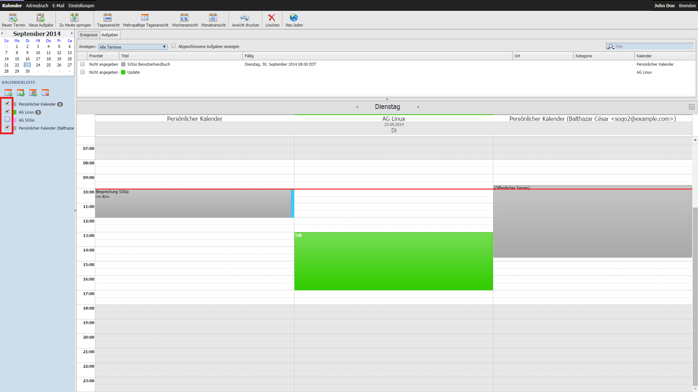
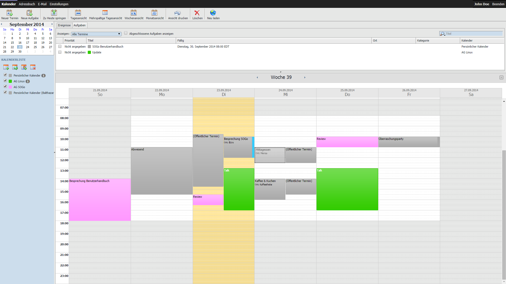
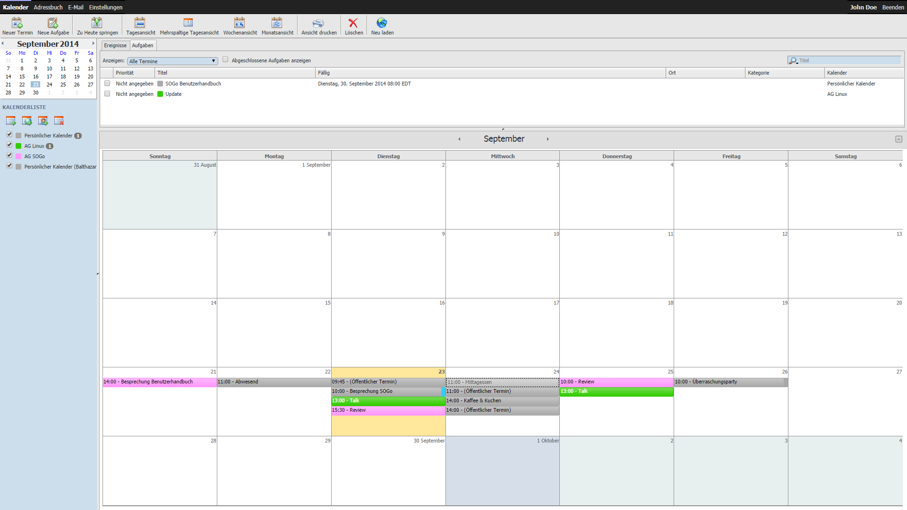
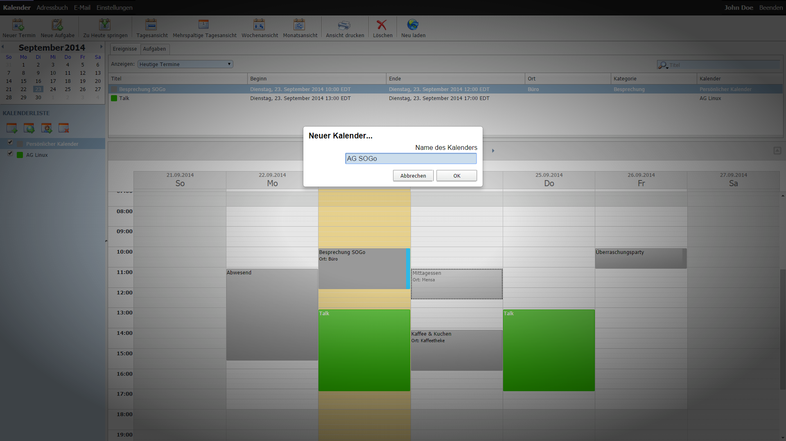

# Inhaltsverzeichnis
1. [Kalender](#kalender)
2. [Aufgaben](#aufgaben)
3. [Adressbuch](#adressbuch)

# Allgemeines

@TODO Pop-Ups
@TODO Einstellungen

# Module

## Kalender

### Ansichtsarten ###

SOGo bietet zur Zeit folgende Ansichtsarten:

Tagesansicht

Mehrspaltige Tagesansicht

Wochenansicht

Monatsansicht

### Anlegen eines Termines

Um einen neuen Termin anzulegen klicken Sie zuerst auf "Neuer Termin" (1) oder wählen Sie durch klicken und halten in der Tages/Mehrspaltigen Tagesansicht/Wochenansicht direkt das entsprechende Zeitfenster (2).

Nun befüllen Sie bitte die einzelen Eingabefelder mit den entsprechenden Eingaben.

<dl>
	<dt>Kategorie</dt> 
	<dd>Kategorien können in den Einstellungen eine farbige Markierung zugeteilt werden und helfen Ihnen damit auf den ersten Blick die Art des Termins zu erfassen.</dd>

	<dt>Kalender**</dt> 
	<dd>Bezeichnet den Kalender in den das Ereignis eingetragen werden soll.</dd>

	<dt>Priorität</dt> ???
	
	<dt>Ganztägiger Termin</dt> 
	<dd>Ganztägige Termine haben keine Start- und Endzeit und werden am oberen Rand der Tagesspalte angezeigt.</dd>
	
	<dt>Zeige Zeit als Verfügbar</dt> 
	<dd>Sollten Sie diese Option wählen, werden Sie für andere Benutzer wärend dieses Termins nicht als belegt angezeigt. Mehr zu diesem Thema finden Sie unter dem Punkt [Teilnehmer einladen]().</dd>
	
	<dt>Verabredungsbenachrichtigungen senden</dt> 
	<dd>Sollten Sie Teilnehmer eingetragen und diese Option ausgewählt haben, wird automatisch eine Einladung verschickt.</dd>
	
	<dt>Wiederholen</dt> 
	<dd>Wählen Sie ein vordefiniertes endloses Interval aus oder erstellen Sie Ihr eigenes durch die Auswahl "Benutzerdefiniert...". Hier können Sie nun auch bei Bedarf ein Enddatum setzen.</dd>
	
	<dt>Erinnerung</dt> 
	<dd>Eine Erinnerung gilt für alle Teilnehmer einer Veranstaltung und kann auch von diesen nicht deaktiviert werden. Unter "Benutzerdefiniert..." haben Sie aber die Möglichkeit eine E-Mail-Erinnerung einzutragen und diese auch nur für sich zu aktivieren.</dd>
	
	<dt>Teilnehmer einladen</dt>
	<dd>siehe [Besprechung planen](#besprechung-planen)</dd>
	
	<dt>Vertraulichkeit</dt>
	<dd>SOGo unterscheidet drei Arten von Terminen: <i>Öffentliche</i> Termine sind für alle Benutzer mit einer Freigabe auf Ihren Kalender sichtbar. <i>Vertrauliche</i> Termine werden "geschwärzt" dargestellt, somit sind nur Datum und Uhrzeit ersichtlich. Ereignise die als <i>privat</i> gekennzeichnet sind, sind nur für Sie sichtbar.</dd>
</dl>

### Besprechung planen ###

Wenn Sie nun "Teilnehmer einladen..." wählen aktivieren Sie die Besprechungsplanung mit anderen Benutzern. Das folgende Fenster öffnet sich:

Um einen Teilnehmer einzuladen, tippen Sie die E-Mail Adresse in die dafür vorgesehene Zeile (1). Sollten Sie eine Freigabe für Kalender dieses Benutzers besitzen, sehen Sie die Belegt-/Frei-Zeiten (2). Nun können Sie über die Eingabefelder (3) den Termin ensprechend anpassen.

Nach dem Klick auf "OK" ist die Teilnehmerplanung abgeschlossen:

Um den Termin endgültig zu speichern, ist "Speichern und Schließen" anzuwählen.

Die eingeladenen Teilnehmer erhalten automatisch eine Einladungs-Mail. Sollten es interne Benutzer der Universität sein, werden die Terminanfragen automatisch in deren Kalender eingetragen! Beim nächsten Aufruf von SOGo hat er dann die Möglichkeit, zuzustimmen oder abzulehnen. Dieses ist auch mit Thunderbird Lightning und Apple iCal möglich.

### Anlegen eines eigenen Kalenders

Um einen neuen Kalender anzulegen, klicken Sie bitte auf das erste kleine Kalendericon (1) links über der Kalenderliste mit dem grünen Plus. Ein kleines Overlay-Fenster öffnet sich in welches Sie den Namen des gewünschten Kalenders eingeben:

Nach "OK" erscheint Ihr neuer Kalender.

### Abonnieren eines freigegebenen Kalenders ###

Klicken Sie dazu oberhalb Ihrer Kalenderliste auf (1).

Nun suchen Sie über das Eingabefeld (1) den entsprechenden Benutzer und öffnen durch einen Klick auf (2) die Liste der freigegebenen Kalender. Nach der Auswahl des entsprechenden Kalenders und der Bestätigung mittels "Hinzufügen" (3) finden Sie diesen nun in Ihrere Kalenderliste.

### Benutzerrechte ###
Um einen Kalender anderen Benutzern oder der Allgemeinheit freizugeben, klicken Sie mit der rechten Maustaste auf den Kalendernamen. Wählen Sie hier "Benutzerrechte...".

Wie Sie sehen können ist hier standardmäßig eine Freigabe für "alle authentifizierte Benutzer" eingetragen. Diese Freigabe wird benötigt, damit alle SOGo Benutzer Ihre Frei-/Belegt-Zeiten einsehen können.

Um weiteren Personen erweiterte Zugriffsrechte zu vergeben, klicken Sie bitte auf (1). 

In dem sich öffnenden Fenster können Sie durch Eingabe (1) einer E-Mail Adresse und dem anschließenden Klick auf "Hinzufügen" (2) Personen eine Freigabe einräumen.

Durch einen Doppelklick auf den entsprechenden Kontakt (1) können Sie nun die Sichtbarkeiten für die verschiedenen Vertraulichkeitsstufen einrichten und Freigaben für das Löschen und Ändern von Eintragen vergeben. Damit der Benutzer Ihren Kalender nicht extra abonnieren muss, empfiehlt es sich die Option "Für den Benutzer abonnieren" (2) auszuwählen.

### Kalendereinstellungen
Klicken Sie mit der rechten Maustaste auf den entsprechenden Kalender und wählen Sie in der erscheinenden Liste "Einstellungen" aus.

Der Name (1) und die Farbe (2) erscheint in jeder Kalenderliste, die diesen Kalender abonniert hat. Durch die Farbe ist auch die einfache Differenzierung in den verschiedenen Ansichten möglich.

### Drucken

Um Ihren Kalender zu drucken klicken Sie bitte auf "Ansicht drucken".

Standardmäßig wird die aktuelle Ansicht zum Druck vorgeschlagen. Durch die Pfeiltasten (1,2) kann der entsprechende Zeitabschnitt angepasst und über die "Formatierung" (3) die entsprechende Darstellung angepasst werden.

## Aufgaben
Den Ereignis- (1) und Aufgabenbreich (2) können Sie über den Pfeil (3) am rechten Bildschirmrand ein- und ausblenden.

### Anlegen einer Aufgabe ###
Um eine neue Aufgabe anzulegen klicken Sie auf "Neue Aufgabe".

Im sich nun öffnenden Fenster können Sie Ihre entsprechenden Angaben vornehmen. Titel, Ort, Kategorie, Kalender, Priorität, Wiederholen, Erinnerung und Beschreibung verhalten sich dabei gleich, wie beim Anlegen eines [neuen Termines](). Folgende Felder sind hingegen neu und helfen Ihnen Ihre Aufgaben zu filtern:

<dl>
	<dt>Beginn</dt>
	<dd>Start Datum/Uhrzeit dieser Aufgabe.</dd>

	<dt>Fällig</dt>
	<dd>End Datum/Uhrzeit dieser Aufgabe.</dd>

	<dt>Status</dt>
	<dd>z.B. "Abgeschlossen am" 2014-09-03 zu 80%.</dd>
</dl>

Über die Liste "Anzeigen" (1), die Checkbox "Abgeschlossene Aufgaben anzeigen" (2) und das Suchfeld (3) können Sie Ihre Aufgaben entsprechend der Eingaben filtern. Die Anzahl der unabgeschlossenen Aufgaben wird dabei in der Kalenderliste rechts neben dem Namen angezeigt. Um eine Aufgabe abzuschließen setzen Sie einen Hacken links (4) in der entsprechenden Zeile.

Da Aufgaben immer einem Kalender zugeordnet sind, erben diese auch die Rechte und Freigaben.

## Adressbuch

### Globale Adressbücher ###

Globale Adressbücher sind durch ein Globus-Icon gekenntzeichnet und bieten die Besonderheit, dass diese nur Durchsucht werden können. Je nach Konfiguration sind dabei nur eine bestimmte Anzahl von Treffern sichtbar.

### Neues Adressbuch anlegen ###

Klicken Sie auf (1) und geben in dem sich öffnenden Fenster den Namen (2) Ihres neuen Adressbuches ein.

### Kontakt hinzufügen ###

Um einen Kontakt in Ihr Adressbuch hinzuzufügen klicken Sie auf "Neue Adresskarte".

Wählen Sie aus der oberen Liste (1) das Zieladressbuch für diesen Kontakt aus und füllen Sie die entsprechenden Felder aus. Dabei stehen nur die sichtbaren Optionen zu Verfügung. Es ist also nicht möglich zusätzliche E-Mail Adressen oder Telefonnummern einzutragen.

### Adressliste erstellen ###

Eine Adressliste ist eine Sammlung von E-Mail Adressen und hilft Ihnen beim regelmäßigen Versenden von Rundmails. Dabei ist zu beachten, dass jede E-Mail Adresse in einer Adresskarte des entsprechenden Adressbuches vorhanden sein muss. Ist dies nicht der Fall, wird ein neuer Kontakt angelegt. Bitte beachten Sie, dass eine nachträgliche Änderung in einer Adresskarte keine Aktualisierung in der Liste nach sich zieht.

Um eine neue Liste zu erstellen wählen Sie das entsprechende Adressbuch aus (1) und klicken Sie auf "Neue Liste" (2).

Nun trage Sie die entsprechenden E-Mail Adressen in die Liste (1) ein. Eine neue Zeile bekommen Sie nach einem Klick auf (2).

